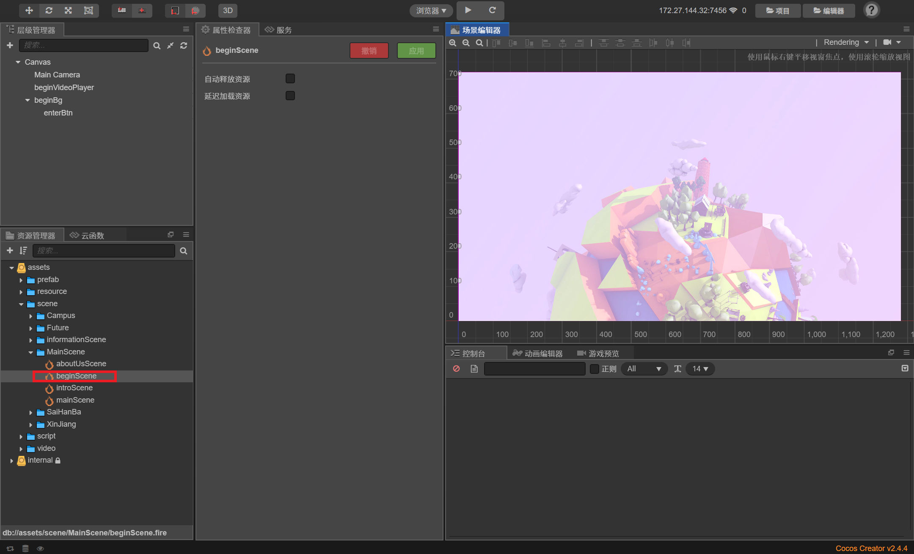
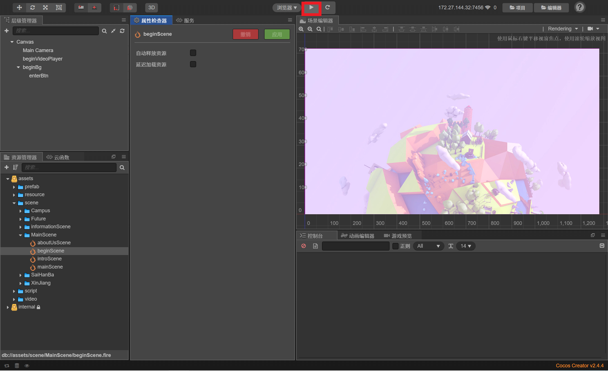

# Forest World

## Intro

`Forest World`是一款基于`Cocos Creator`游戏引擎制作的小游戏。游戏流程虽然简短，但制作精（cu）良（cao）。

游戏的基本主旨是关于中国在达成全球碳中和事业中做出的贡献。我们适当结合了**亿些天（bu）马（zhao）行（bian）空（ji）的想象**。	

具体的内容就不再透露啦，请大家在游戏中自行体验。

## 如何运行

正如前文所说，本游戏基于`Cocos Creator`游戏引擎开发，并且仅仅公布了源码，没有进行编译处理，所以为了在您的设备上运行该游戏，请预先在您的设备上安装`Cocos Creator V`，并按照如下的步骤进行操作

1. 打开`CocosDashboard`，并导入项目所在的文件夹

2. 双击导入后的项目，进入`Cocos Creator`编辑器页面

3. 在左侧导航栏中点击，进入`beginScene`

   

4. 点击界面上方的运行按钮，在浏览器中享受游戏吧！

   

5. <del>其实是不太会编译，所以只能在引擎里运行啦</del>

6. <del>才不是因为懒呢，哼</del>

## 关于我们

`Forest World`是由一个参加呢喃软院的EL程序设计竞赛的4人团队所制作。

队伍名称：**购物毒瘤敌敌畏（gwdlddw）**

<del>关于名称的由来嘛，还要从神奇的缩写与输入法说起</del>

队伍成员与具体分工：

cyr：队长，美工组成员，游戏“你是什么垃圾”制作者

hzr：总架构，UI制作者，游戏“快乐连线”制作者

jyf：美工组成员，游戏“逃离过氧星球”制作者

zkr：<del>摸鱼壬</del>，readme文档作者，游戏“植物大战风沙”制作者，负责将已完成的项目上传至`GitHub`

游戏开场动画由美工组剪辑制作，游戏中用到的大部分图片素材均来源于美工组的笔下（美工组yyds），资料卡部分的视频来源为`bilibili`，水印中均已标明up主。部分图片、音频素材来源网络。
